# Lab 1

## Part 1: Git and Github

Git and Github are open source version control software. In this lab, you will be learning the basics of using git in the command line. You will need to have git installed in the command line to do this lab. If you do not have git installed on your system, please follow the instructions [here](./Git_commands_.md).

Git and Github are not the same thing. Git is the software used in the command line, and github is a website. \_\_\_

### Accepting Assignments

Before we begin learning how to use git on the command line, you need to accept an assignment on github.

Follow this [assignment link](https://classroom.github.com/a/s0uF0VL7) to accept the assignment.

Once you have accepted the assignment, copy the repo link by clicking on the green button that says Code, and then clicking the clipboard button. This automatically copies the repo link to your clipboard.


### Cloning

Once you have accepted the lab-01 assignment on github, you must obtain a local copy of the assignment. This is called _cloning_ the repository. Open up your terminal and navigate to the location you want to store your assignment. For example: `cd cs_projects/cs3`

To clone the assignment, run the command `git clone <repo_link>` in the terminal. Replace \<repo_link> with the url that you copied when you accepted the assignment.

Running this comamnd will create a folder in the current directory named after the assignment repo. It should be the name of the assignment followed by your github username.


Navigate into the new folder.

`cd lab-01-<gihub_username>`

Now you are in the assignment's working directory. You can open this project in VSCode.

### Status and Add

Next we are going to edit this assignment and make git track the changes we have made. We will be learning two commands: git status and git add.

Enter the command `git status` into the terminal. Since we have not changed anything, it should look like this:


Move to VSCode and open the file called README.md. Edit the file so it looks like this:

`## Lab-01`\
`Hello World!`

Then save it.

If we run `git status` in the terminal again, we should see that git knows the file has been changed.


Now we need to add these changes to be committed. This is also known as _staging_ the files. Run the command `git add README.md`, and then `git status` again.


### Commit and Push

Now that the changes we have made are added, we can commit them. Committing is like saving the changes you have made in git.

Run `git commit -m "Edited the README"`. `-m` stands or "message". so, you are commiting your changes _and_ you are commenting it so you can remember what this commit was abouty. The output should look like this:


Go back to your assignment page on github and refresh the page. Do you see your commit?

No. You do not. Committing only saves progress to your local machine. Github will not see the commit until we have _pushed_ it.

Go back to your terminal and run `git push`. You may need to set your github email and username in the terminal before the push is accepted. You may do this in the terminal with the commands below. You would normally do this in the git installation process.

`git config --global user.name "github_username"`\
`git config --global user.email "github_email"`


Refresh your assignment page again. You should see your commit message at the top of the page and next to the files that were changed.


Now you know the basic commands you will need to use git and github!

# Part 2: About the Project

## Understanding the File Structure

All the assignments in this class will follow the file structure shown below. main.cpp is in the root folder, and classes and other libraries are stored in the `includes/` folder. The test files are where you will be writing your googletest suites later in this lab.


When you open the project in VSCode, this is what you will see on the left panel:


## Building and Running

### CMakeLists.txt

The github grader uses the CMakeLists.txt file to build your project. When you submit your code, you need to tell it what files are needed to buld the test executables.

In your CMakeLists.txt file you will need to edit the `ADD_EXECUTABLE` inputs. Every .cpp file used in that build needs to be listed.

`ADD_EXECUTABLE(testB`\
 `_tests/_test_files/testB.cpp`\
 `includes/stub/stub.cpp`\
 `)`

The next two sections will show you the steps to run the project from the terminal in different environments. Follow the steps for the type of OS you have.

Note: When you submit your code to github, it will run the commands to build for Mac and Linux. So if you use Windows, feel free to take some time to look at the Mac and Linux build steps below before moving on.

### Mac and Linux

Make sure your .cpp files are correctly added in the CMakeLists.txt.

In your root folder, create a build folder from the terminal using `mkdir build`. cd into the build folder, and run `cmake ..`

run the command `make`

To run the testA executable enter `./bin/testA` into the terminal

### Windows

In your root folder, clone the googletest framework with `git clone https://github.com/google/googletest.git`

You will need to build the googletest framework with cmake before building any executables for yourself. This step only needs to be done once; the first time you clone a new project.

To do this, you will need to run the following set of commands in the terminal one after another:

`cd googletest`\
`mkdir build`\
`cd build`\
`cmake -G "MinGW Makefiles" ..`\
`make`\
`cd ../../`

In the future you can run these all at the same time as: `cd googletest && mkdir build && cd build && cmake -G "MinGW Makefiles" .. && make && cd ../../`

Now we can compile the lab project with `g++ -std=gnu++11 -o testA testA.cpp -Igoogletest/googletest/include -pthread -Lgoogletest/build/lib -lgtest`
This command will generate an executable file called testA.exe. You need to add all .cpp files needed for the project you are building in this command. List them all after testA.cpp.

To run the executable, enter `testA.exe` into the terminal.


# Part 3: Fixing the Output

## Googletest

Now that you know how to build and run your project, let's put those skills to use. First copy the code from the file given to you named basic_test into basic_test.cpp and testA.cpp. This code uses the googletest testing framework, and will be used to grade your assignments.

In the basic_test file, you will see functions named `TEST` calling `EXPECT_EQ`. Like this:

```
TEST(TEST_STUB, TestStub) {
   EXPECT_EQ(1,test_stub());
}
```

### Test modules

The first argument in the TEST function is used to name the test module. A test module tests a specific function or operation. The second argument labels what is being tested in each test.

In this assignment there are 5 array functions to test: init, append, find, print, and at. So some examples of test module names would be INIT_TEST, APPEND_TEST, FIND_TEST, etc. Within the APPEND_TEST module the specific tests might be testing append to an empty array and so on. So some test names in this module might be StandardArrayTest and EmptyArrayTest and so on.

Both the module name and test name of each test will be printed alonside the pass/fail output when the test executable is run. Properly labeling your tests and modules will make it easy to tell exactly what doesn't work from the executable output.

### EXPECT_EQ

`EXPECT_EQ` is the function that googletest uses to determine the output of a test. It compares `1` to the output of `test_stub()`. If the values are not equal, the test will fail.

### Assignment Details

It is a good idea to write your tests before your code. In this case you will be copying most of your code.

First, copy the code from basic_test into basic_test.cpp and testA.cpp.


Create a new folder named array_functions, and array_functions.h and array_functions.cpp within the new folder.


Copy the array_functions code given to you. Be careful to follow the function declarations exactly. The tests used by the github autograder will expect your functions to be in a specific format, and will give you a 0 if not declared correctly.

`void _array_init(int a[], int size, int x=0);`\
`void _append(int a[], int& size, int append_me);`\
`int _find(const int a[], int size, int find_me);`\
`int& _at(int a[], int size, int pos);`\
`ostream& _print_array(const int a[], int size, ostream& outs = cout);`


When you have written a test where all cases pass, add, commit, and push your changes to github to submit your assignment. Don't forget to make sure the ADD_EXECUTABLE testB in your CMakeLists.txt is correct before submitting your code to github.


=================================================

# Project Organization:

Once you have cloned the project and you open VSCode, this is what you will see:

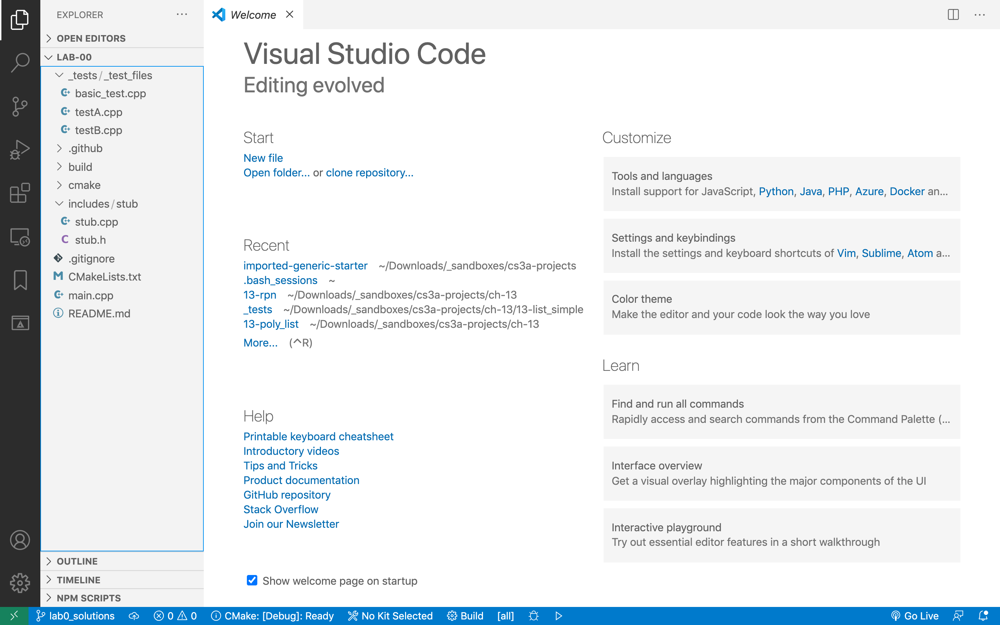
</br>

## File system:

On the left panel (Explorer, ) you will find the three most important folders in this directory:

`_tests`: which holds your google test files. The grader will run these files to obtain your score. You will ignore `testA.cpp` for the most part. The bulk of your work will be done in `testB.cpp`.

`includes`: contains a folder for each of the libraries / classes your project depends on. In this starter code, you only have a `stub` folder that contains `stub.h` and `stub.cpp`. These files are `#include`d in `testB.cpp`

`build`: is where you go to build and run your project. This is where all your compiled and executable files will end up.


</br>

## A look at the test files:

### basic_test.cpp: My sample test goes here.

This is the placeholder file for a sample test file you wilkl be given for each and every project. The purpose of this file is to demonstrate the functionality of the project and for you to make sure that your function signatures and class declarations match the grader's expectations. (otherwise, your projects will not earn a score.)

### testB.cpp: Your tests go here

This is the file that will contain your tests of your own functions and classes. All your test fils that will demonstrate the correctness of your poject are housed here. Part of your grade relies on the quality and success of the tests in this file.


</br>

## CMakeLists.txt

### List your cpp files here

the `CMakeLists.txt` file is what the cmake program looks at to know how to build your project. How the pieces fit together. The grader will also use this file to build your project on the server side (once you submit - push your projects to github)
Please note that you will **only** make changes to the bottom half of this file.
It's worth mentioning that every **.cpp** file that is used in any of your test files (main, basic_test, testA, testB) will have to be listed here. Notice how the stub.cpp is listed under ADD_EXECUTABLE(testB...)
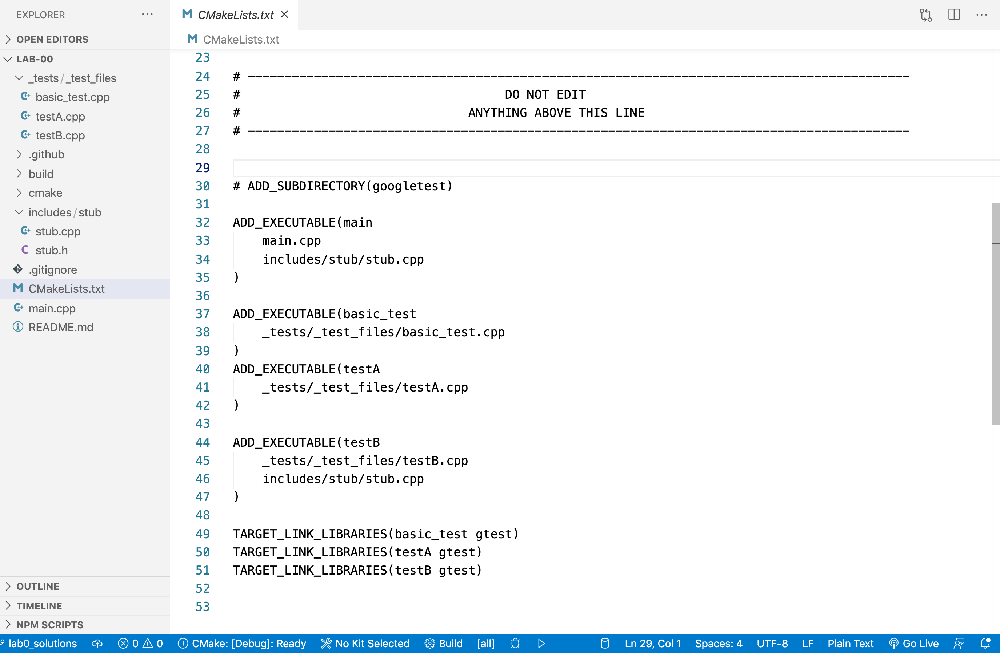
</br>

## stub.h, stub.cpp

Not too much to see here. The stub is used in testB to demonstrate how a function will be tested by the googletest framework in `testB.cpp`. All your functions and classes will be housed under their own folder (`stub/`, `array_functions/`, `vector/`, etc.) which will, in turn, go under the `includes/` folder.


</br>

## Find [`basic_test.cpp`](basic_test.cpp)

You will be supplied with a [`basic_test.cpp`](basic_test.cpp) file. You will copy this file and overwrite the existing _generic_ `basic_test.cpp` in your project folder. After this, you will **never** edit the `basic_test.cpp` file.

[`basic_test.cpp`](basic_test.cpp) demonstrtes the functionality of the project and gives you an opportunity to make sure your function signatures and class declarations match those of the grader.
You should be able to compile and run the `basic_test.cpp` with your functions.

Pay special attention to the `#include` path at the top. Your file structure has to be **exactly** the same as the one depicted here.

###### click [here](basic_test.cpp) to download basic_test.cpp if you have not already.

<br>


</br>

## Add a new folder to the `includes/` folder.

name this folder `array_functions`.

This is where you will add your `.h` and `.cpp` files

</br>

## Add two files to this folder.

Name these two files `array_functions.h` and `array_functions.cpp`

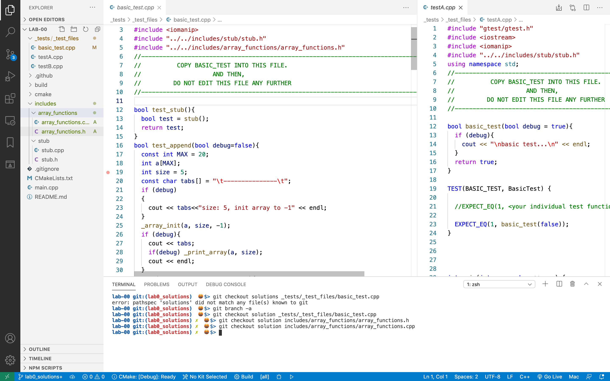
</br>

## Add the function signatures.

add these function signatures to the `array_functions.h` file:

```
void _array_init(int a[], int size, int x=0);
void _append(int a[], int& size, int append_me);
int _find(const int a[], int size, int find_me);
int& _at(int a[], int size, int pos);
ostream& _print_array(const int a[], int size, ostream& outs = cout);

```

Normally, you will either be given these function signatures or you will _deduce_ them from the code in `basic_test.cpp`

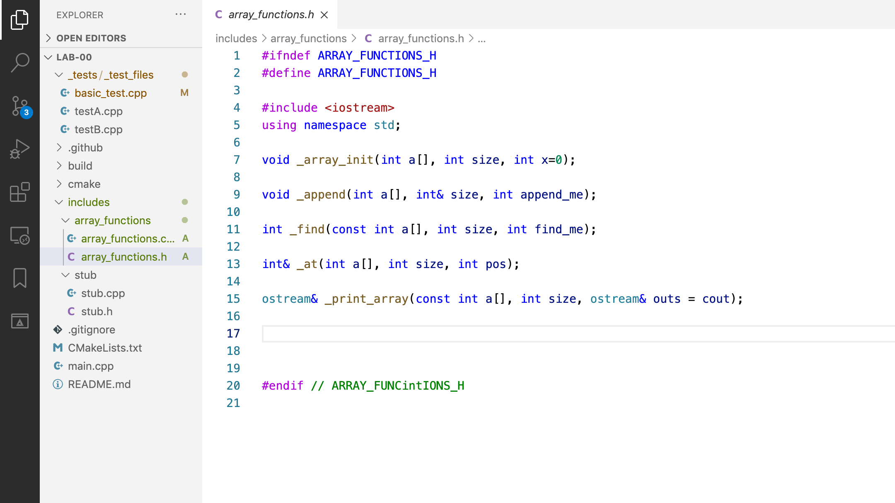
</br>

## Write function _stubs_

Function stubs are just function signatures with a return statement if needed.

Function stubs are a quick way to get the project up and running. I find the students who adopt this method in their workflow have an easier time completing projects.

### TIP:

I normally copy the function signatures and paste them into the `.cpp` file. Then, I replace the `;` at the end of the line with braces (`{}`). Then, I add the returns whenever necessary.

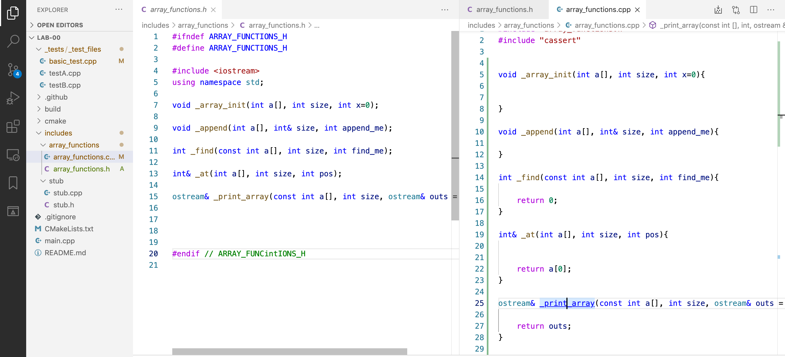
</br>

## Open terminal:

If you are using VSCode, you can open the terminal by pressing [ctrl][`]

[`] is the key in the top left of the keyboard under [~]

Using the terminal in this way is very convenient.
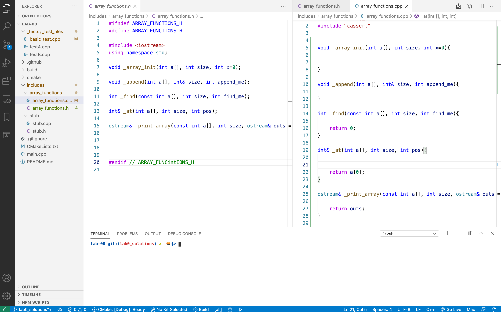
</br>

## Go to `build/` and run `cmake`:

`cd` into the `build/` folder, and from there, run `cmake ..`

This will run `cmake` on your _parent_ folder. (that's what `..` means. `cmake ..` means run `cmake` on my parent folder.)`cmake` creates a bunch of files and you do not want these files in the root folde of your project. Running `cmake` from `build/` will make sure all your auxilary files are created inside the `build/` folder.

Hopefully, your `cmake` will run without any problems and it will tell you that "Build files are written to `. . . build/`"

Now, we are ready to compile our project using `make`


</br>

## `make`

type `make` to compile your project:

If you followed these steps faithfully, you will have the same syntax errors that I had, namely that all those functions we defined in `array_functions.h` and `.cpp` are **undefined!**

We will spare you the suspense. The reason for this error is that we never added `array_functions.cpp` to our `CMakeLists.txt`. Remember that **all .cpp** files must be listed in the CMakeLists.txt under `ADD_EXECUTABLE`
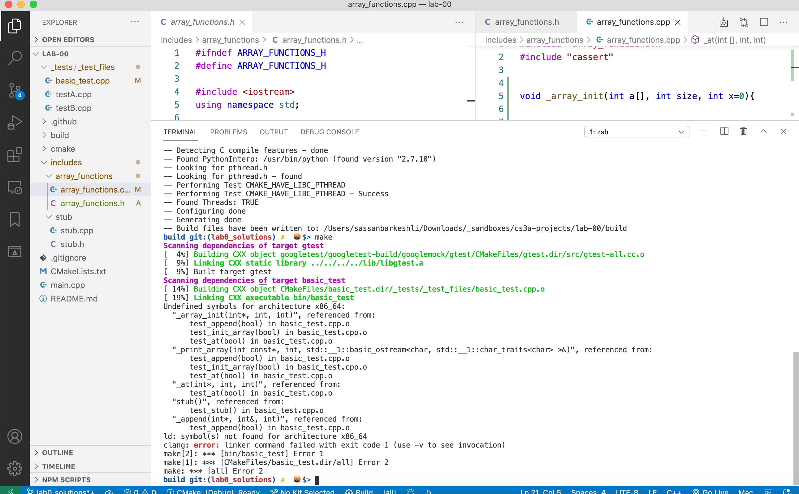
</br>

## `make` errors, zoomed in:

Here is a closer, more readable look at the errors reported by `make`


</br>

## back at the `CMakeLists.txt`:

Notice that we are missing the `array_functions.cpp` from the `basic_test` `ADD_EXECUTABLE` statement:

So, let's add it...


</br>

## Add `arrauy_functions.cpp` to the `ADD_EXECUTABLE(basic_test... )`

**Do not** use commas to separate the files.

**Do NOT** include `.h` files.

Normally, **all** three executables will need all the `.cpp` files

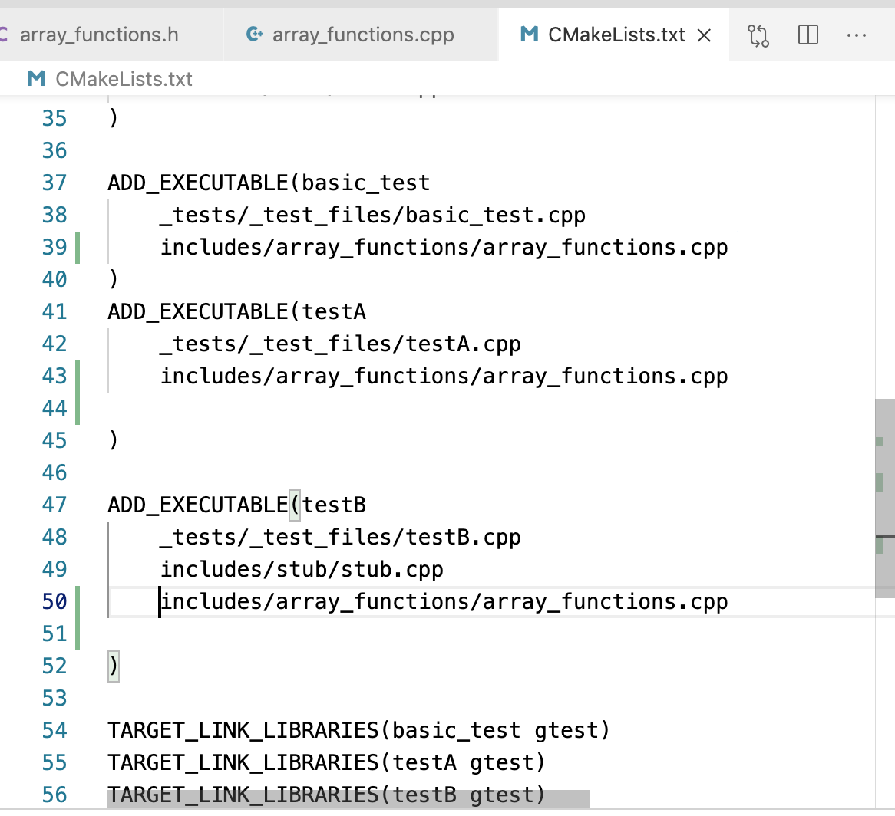
</br>

## `make` again:

Let's run `make` again and pray that...

... and, we have more syntax errors. Default arguments can only be specified in the declration of the function and **not** in the definition.

So, we must remove all those default values for the defalut arguments on every function.


</br>

## Fix the `_print_array` function...

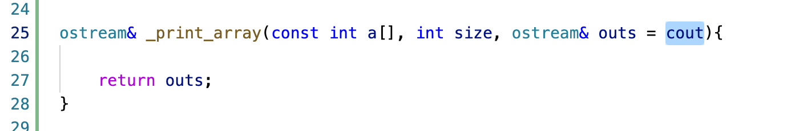
</br>

## by removing the default value `= cout`

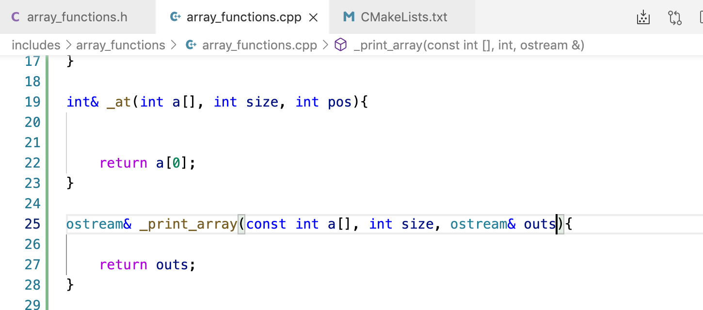
</br>

## Same with `_array_init`:


</br>
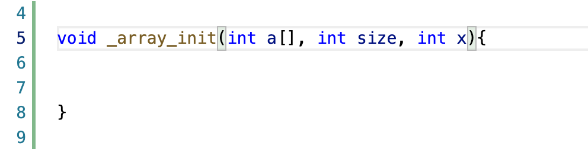
</br>

## `make` one more time:

and this time it will run successfully.

## run `git status`, `add`, and `commit` with the message _success on make with stubs_

This is a huge step. We now have a working project eventhough our functions are basically empty.

Now, we can go in and fill the functions one by one and write tests for them. These tests will be written in the `testB.cpp` file.

### I cannot overstate the importance of having **regular** `commit`s in your project. This is a large part of the evaluation of your project by me.

</br></br>


</br>

## Fill in the functions one by one. `testB.cpp` can be seen waiting to host the test functions.

</br>
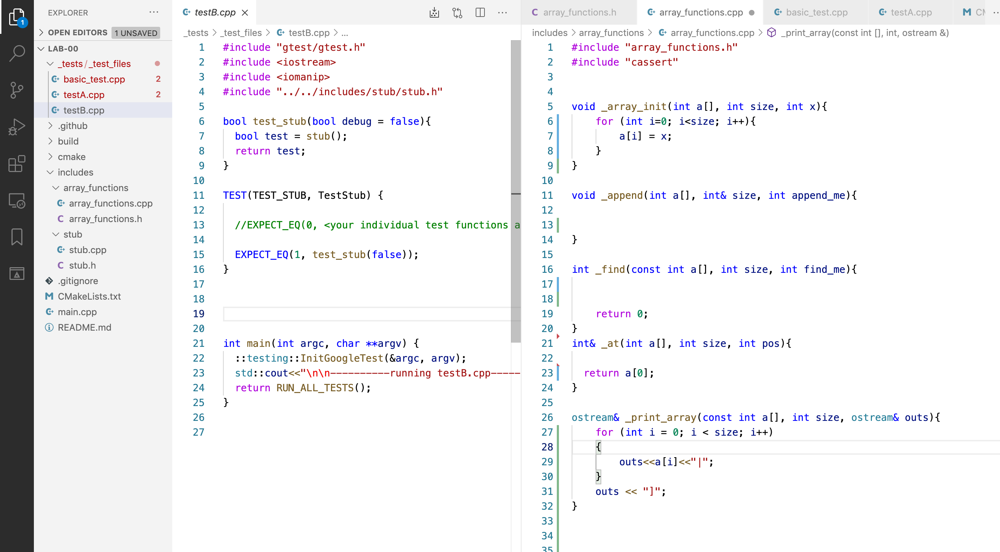
</br>

## `testB`: our first test:

After implementing the \_array_init and \_print_array functions, we will write a simple test that will verify that the \_init function works as it should.

The test function is boolean. It returns `true` if the init function works properly and false otgherwise.

Call the `_array_init` function and then go through each and every cell and verify that each element is -1.

If you find one cell that is not -1, return false.

Note also that we return `true` at the end of the test function. I do this in every test function I write.

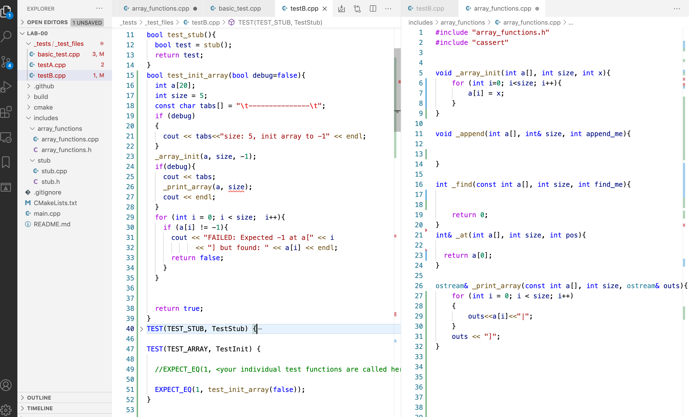
</br>

#The `TEST` function:

The `TEST` function is part of the googletest testing framework. To simplify our work, we always use the same format for the `TEST` function: Declare a `bool success` and assign it to the return value of the test function.

Then, compare `success` with `1` or `true`

A quick word about the two arguments of the `TEST` function:

The first is the name of the _test suit_ and the second is the name of this very test. Each test suit may contain multiple tests. Later, we will write another test for the `_append` function with the same first argument as this test: `TEST_ARRAY`. By the time we are done, the `TEST_ARRAY` test suite will have three individual tests.

Pay attention to the **naming conventions** for this course: The test suite will be in ALL CAPS with underscores between the words. The test names will be camel case and regular function names are all lower case with underscores.

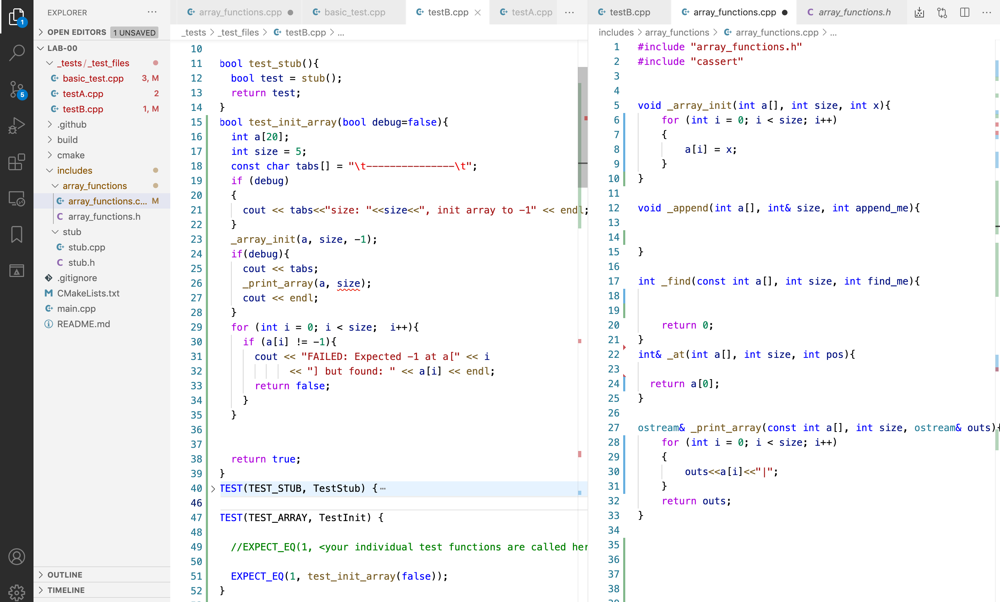
</br>

## `make` and RUN!!

This time, we will run `make` successfully and then, we run the `testB` executable by typing `./bin/testB`

This means execute the file named `testB` that is located in the `bin` folder which is under the `current folder`. The bin folder is created by `make`

remember that `.` means current folder and is not optional. You **must** include the dot in the call to execute `testB`

This will display two successful test runs: one for the `stub` test that was already part of the project, and one for the `TestInit` that we just wrote.

This means that our test function returned `true`.

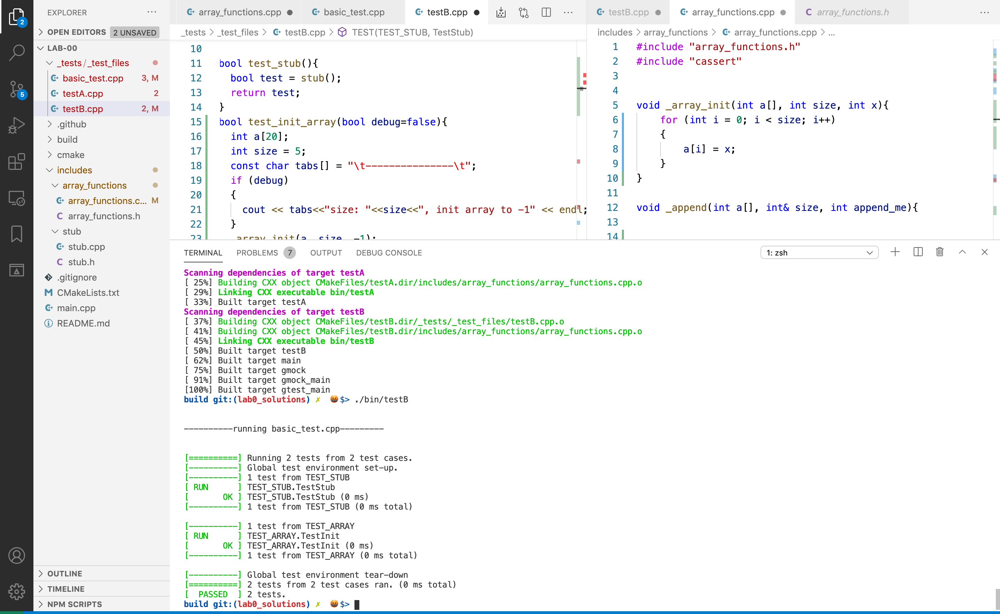
</br>

## Implement `_append` and `_at`:

We have thus far implemented `_array_init` and `print_array`. Let's implement `_append` and `_at` as well.

You will _borrow_ my code for this particular lab, but make sure you comment the code very well.

Once we have implemented `_append`, write the test for it in `testB.cpp`. Don't forget to add a `TEST( )` for the `test_append()` function.

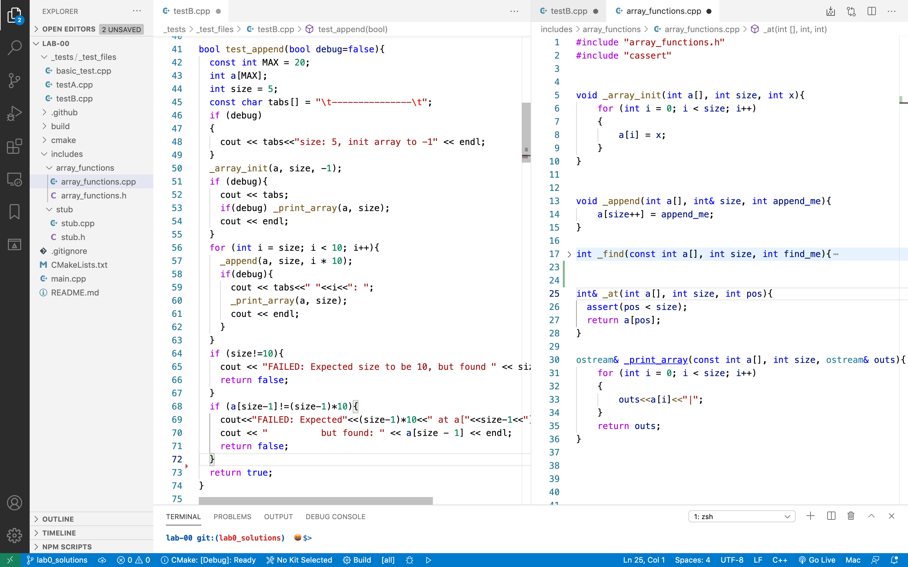
</br>

Obviously, this is done in the `testB.cpp` file. Again, do not forget to add the `TEST( )` function for `test_at()`

Once again, you will _borrow_ my code for this particular lab, but make sure you comment the code very well.


</br>

## `make` and run `testB.cpp` again:

Let's `make` and run `testB` to make sure our `test_append` and `test_at` pass:


</br>

## Implement the `_find()` function on your own

You will also write a `test_find()` function. Once you have implemented `_find()` and written the test function for it (don't forget to comment) you are ready to `make` and run `testB` once again.

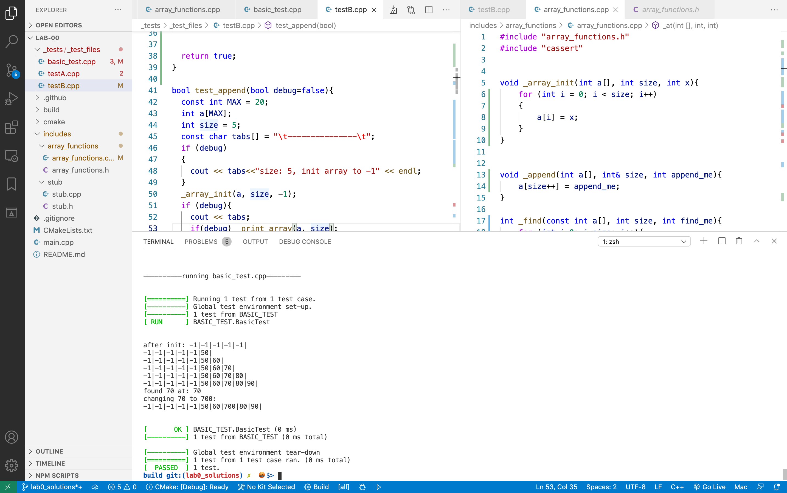
</br>
## Finally, we can run `basic_test.cpp`:
Now that we have implemented all the functions that are used in `basic_test.cpp`, we can `make` and run this file.

I cannot overemphasize how important it is for this test to be able to compile and run **without** your editing it in any way. If your project cannot compile and run `basic_test`, the grader will not be able to run your project.


</br>

## `git add` and `git commit`

we go back to the root directory by typing `cd ..` - remember that `..` means parent directory. `cd ..` means change directory to the parent.

My commit message will let me know what stage of the development I am in. I have just PASSED both the `basic_test` and `testB`
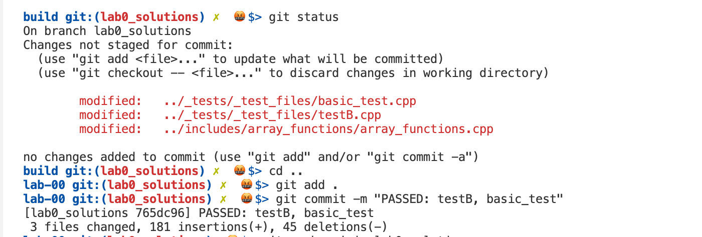
</br>
