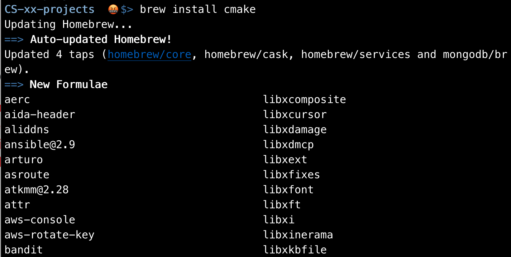
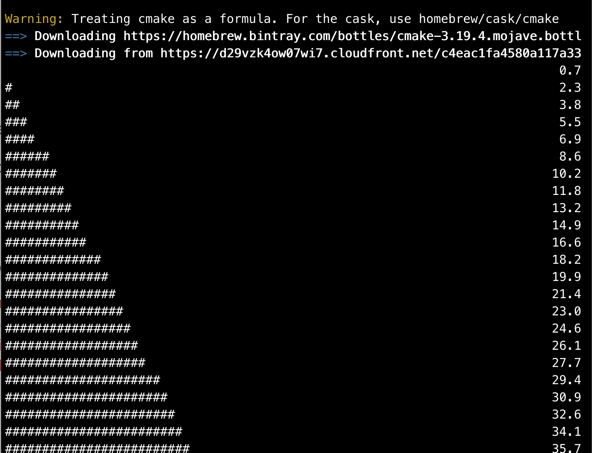
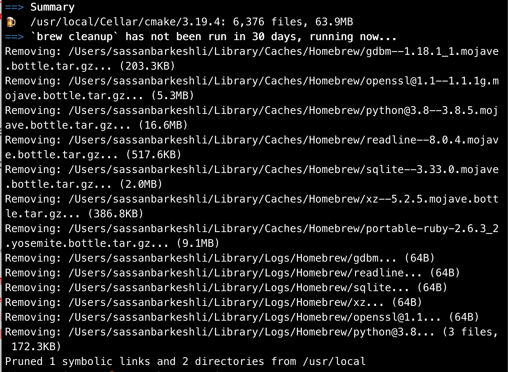

# Mac Insructions</br>

- ## [Installing `git`](#mac_installing_git)</br>
- ## [Installing `cmake`](#mac_installing_cmake)</br>

# <BR><BR><BR><BR><BR>

# <BR><BR><BR><BR><BR>

<a name="mac_installing_git"></a>

#  installing git 

You may have to install git.
use `homebrew` to install git.

<br/><br/>

## Tell git who you are:

Once git is installed, you may need to let it know who you are: Give git your name and email address:

```
git config --global user.name "barkeshli, sassan"
git config --global user.email sxbarkeshli@pasadena.edu

```

# <BR><BR><BR><BR><BR>

<a name="mac_installing_cmake"></a>

#  installing cmake 

## is `cmake` installed?

Let's check to see if `cmake` is installed on your system: type `cmake --version` at the commandline.

If you do not get a response similar to this, then you do not have `cmake` on your system and you have to install it.

> 

</br>

## install `cmake`

We use `homebrew` to install `cmake`:

```
brew install cmake
```

This will go on and on...

> 

</br>

... and on...

</br>

> 

</br>

... and on...

</br>

> 

</br>

... and on...

</br>

> Finally, cmake is installed!
> 

</br>

## check the version of the cmake again:

To make sure `cmake` is intalled correctly, run `cmake --version` again:

> 

</br>

---

## Once everything is installed, you can move on to the [next step](start_project.md)