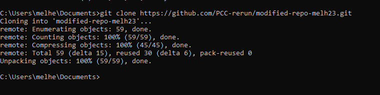

# Lab 1

## Part 1: Git and Github

Git and Github are open source version control software. In this lab, you will be learning the basics of using git in the command line. You will need to have git installed in the command line to do this lab. If you do not have git installed on your system, please follow the instructions [here](./Git_commands_.md).

Git and Github are not the same thing. Git is the software used in the command line, and github is a website. \_\_\_

### Accepting Assignments

Before we begin learning how to use git on the command line, you need to accept an assignment on github.

Follow this [assignment link](https://classroom.github.com/a/qidO1KYV) to accept the assignment.

Once you have accepted the assignment, copy the repo link by clicking on the green button that says Code, and then clicking the clipboard button. This automatically copies the repo link to your clipboard.


### Cloning

Once you have accepted the lab-01 assignment on github, you must obtain a local copy of the assignment. This is called _cloning_ the repository. Open up your terminal and navigate to the location you want to store your assignment. For example: `cd cs_projects/cs3`

To clone the assignment, run the command `git clone <repo_link>` in the terminal. Replace \<repo_link> with the url that you copied when you accepted the assignment.

Running this comamnd will create a folder in the current directory named after the assignment repo. It should be the name of the assignment followed by your github username.



Navigate into the new folder.

`cd lab-01-<gihub_username>`

Now you are in the assignment's working directory. You can open this project in VSCode.

### Status and Add

Next we are going to edit this assignment and make git track the changes we have made. We will be learning two commands: git status and git add.

Enter the command `git status` into the terminal. Since we have not changed anything, it should look like this:


Move to VSCode and open the file called README.md. Edit the file so it looks like this:

`## Lab-01`\
`Hello World!`

Then save it.

If we run `git status` in the terminal again, we should see that git knows the file has been changed.


Now we need to add these changes to be committed. This is also known as _staging_ the files. Run the command `git add README.md`, and then `git status` again.


### Commit and Push

Now that the changes we have made are added, we can commit them. Committing is like saving the changes you have made in git.

Run `git commit -m "Edited the README"`. `-m` stands or "message". so, you are commiting your changes _and_ you are commenting it so you can remember what this commit was abouty. The output should look like this:


Go back to your assignment page on github and refresh the page. Do you see your commit?

No. You do not. Committing only saves progress to your local machine. Github will not see the commit until we have _pushed_ it.

Go back to your terminal and run `git push`. You may need to set your github email and username in the terminal before the push is accepted. You may do this in the terminal with the commands below. You would normally do this in the git installation process.

`git config --global user.name "github_username"`\
`git config --global user.email "github_email"`


Refresh your assignment page again. You should see your commit message at the top of the page and next to the files that were changed.


Now you know the basic commands you will need to use git and github!

# Part 2: About the Project

## Understanding the File Structure

All the assignments in this class will follow the file structure shown below. main.cpp is in the root folder, and classes and other libraries are stored in the `includes/` folder. The test files are where you will be writing your googletest suites later in this lab.


When you open the project in VSCode, this is what you will see on the left panel:


## Building and Running

### CMakeLists.txt

The github grader uses the CMakeLists.txt file to build your project. When you submit your code, you need to tell it what files are needed to buld the test executables.

In your CMakeLists.txt file you will need to edit the `ADD_EXECUTABLE` inputs. Every .cpp file used in that build needs to be listed.

`ADD_EXECUTABLE(testB`\
 `_tests/_test_files/testB.cpp`\
 `includes/stub/stub.cpp`\
 `)`

The next two sections will show you the steps to run the project from the terminal in different environments. Follow the steps for the type of OS you have.

Note: When you submit your code to github, it will run the commands to build for Mac and Linux. So if you use Windows, feel free to take some time to look at the Mac and Linux build steps below before moving on.

### Mac and Linux

Make sure your .cpp files are correctly added in the CMakeLists.txt.

In your root folder, create a build folder from the terminal using `mkdir build`. cd into the build folder, and run `cmake ..`

run the command `make`

To run the testA executable enter `./bin/testA` into the terminal

### Windows

In your root folder, clone the googletest framework with `git clone https://github.com/google/googletest.git`

You will need to build the googletest framework with cmake before building any executables for yourself. This step only needs to be done once; the first time you clone a new project.

To do this, you will need to run the following set of commands in the terminal one after another:

`cd googletest`\
`mkdir build`\
`cd build`\
`cmake -G "MinGW Makefiles" ..`\
`make`\
`cd ../../`

In the future you can run these all at the same time as: `cd googletest && mkdir build && cd build && cmake -G "MinGW Makefiles" .. && make && cd ../../`

Now we can compile the lab project with `g++ -std=gnu++11 -o testA testA.cpp -Igoogletest/googletest/include -pthread -Lgoogletest/build/lib -lgtest`
This command will generate an executable file called testA.exe. You need to add all .cpp files needed for the project you are building in this command. List them all after testA.cpp.

To run the executable, enter `testA.exe` into the terminal.


# Part 3: Fixing the Output

## Googletest

Now that you know how to build and run your project, let's put those skills to use. First copy the code from the file given to you named basic_test into basic_test.cpp and testA.cpp. This code uses the googletest testing framework, and will be used to grade your assignments.

In the basic_test file, you will see functions named `TEST` calling `EXPECT_EQ`. Like this:

```
TEST(TEST_STUB, TestStub) {
   EXPECT_EQ(1,test_stub());
}
```

### Test modules

The first argument in the TEST function is used to name the test module. A test module tests a specific function or operation. The second argument labels what is being tested in each test.

In this assignment there are 5 array functions to test: init, append, find, print, and at. So some examples of test module names would be INIT_TEST, APPEND_TEST, FIND_TEST, etc. Within the APPEND_TEST module the specific tests might be testing append to an empty array and so on. So some test names in this module might be StandardArrayTest and EmptyArrayTest and so on.

Both the module name and test name of each test will be printed alonside the pass/fail output when the test executable is run. Properly labeling your tests and modules will make it easy to tell exactly what doesn't work from the executable output.

### EXPECT_EQ

`EXPECT_EQ` is the function that googletest uses to determine the output of a test. It compares `1` to the output of `test_stub()`. If the values are not equal, the test will fail.

### Assignment Details

It is a good idea to write your tests before your code. In this case you will be copying most of your code.

First, copy the code from basic_test into basic_test.cpp and testA.cpp.


Create a new folder named array_functions, and array_functions.h and array_functions.cpp within the new folder.


Copy the array_functions code given to you. Be careful to follow the function declarations exactly. The tests used by the github autograder will expect your functions to be in a specific format, and will give you a 0 if not declared correctly.

`void _array_init(int a[], int size, int x=0);`\
`void _append(int a[], int& size, int append_me);`\
`int _find(const int a[], int size, int find_me);`\
`int& _at(int a[], int size, int pos);`\
`ostream& _print_array(const int a[], int size, ostream& outs = cout);`


When you have written a test where all cases pass, add, commit, and push your changes to github to submit your assignment. Don't forget to make sure the ADD_EXECUTABLE testB in your CMakeLists.txt is correct before submitting your code to github.


=================================================

# <BR><BR><BR><BR><BR>
