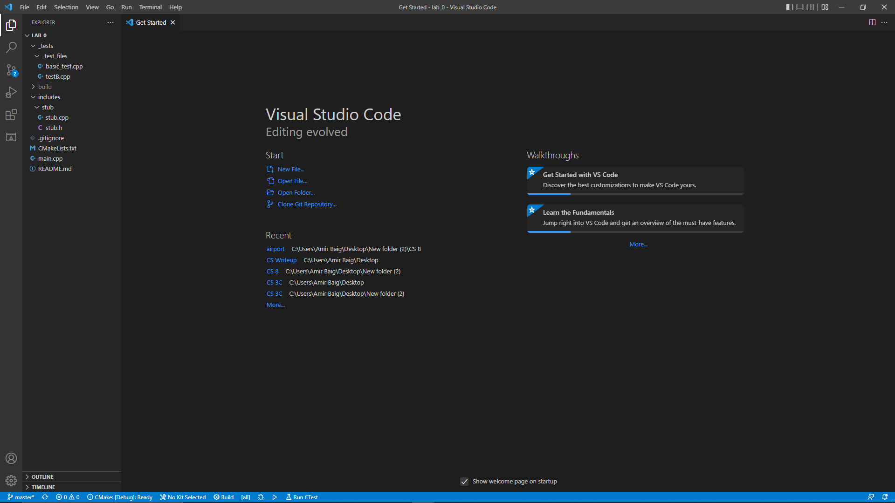
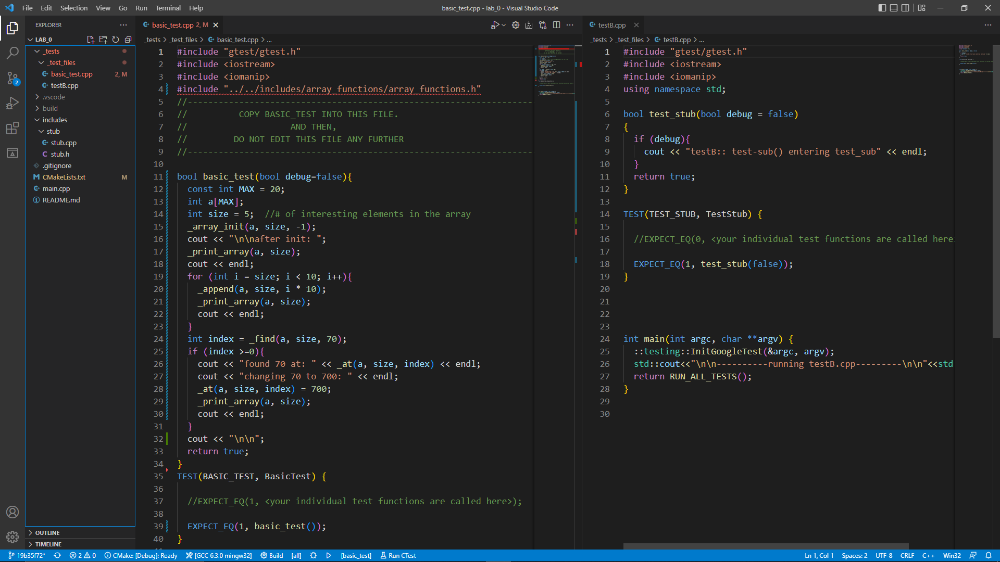
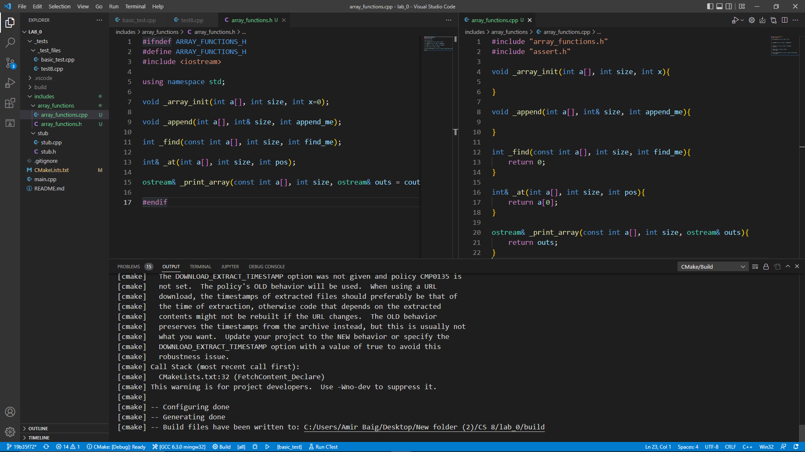
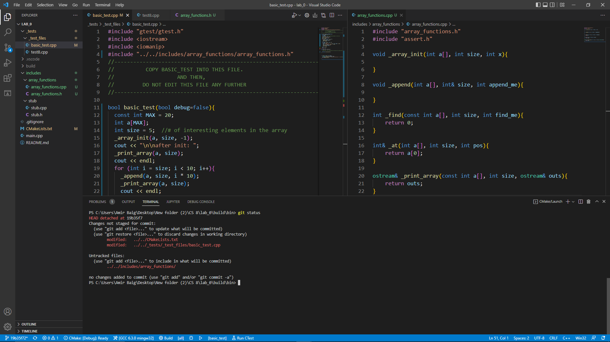
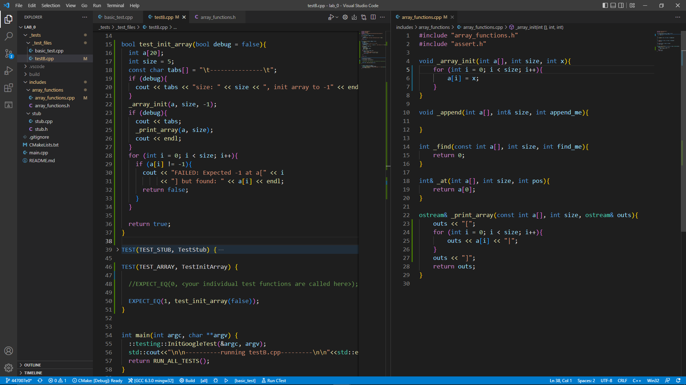
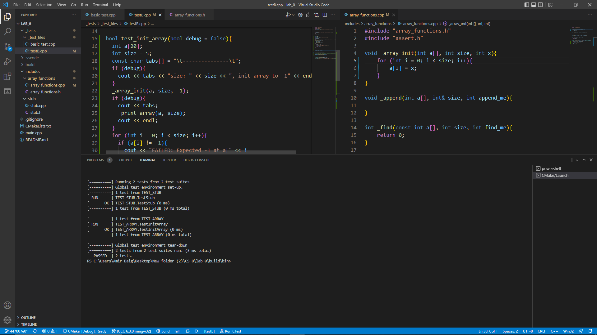
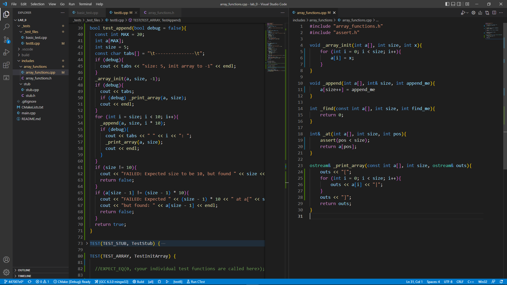

# Starting the lab

- ## [Accept the assignment ](#-accept-the-assignment-)
- ## [Project Organization ](#-project-organization-)
- ## [Build and run walkthrough ](#-build-and-run-walkthrough-)
- ## [Writing Tests](#-writing-tests-)
- ## [Completing the Project](#-completing-the-project-)

<br><br><br><br><br>


#  Accept the assignment 

## Here are the **assignment links** for [CS3A](https://classroom.github.com/a/qidO1KYV) and [CS8](https://classroom.github.com/a/DYb_nBnE)

<br>

## Accept assignment page:

Once you click on the [assignment link](https://classroom.github.com/a/qidO1KYV), we need you to _accept_ the assignment. This will create a repo under your github username. But before you click and accept the assignment, let's look at a couple of things a bit more closely.<br>

> 

<br>

## Your repo name:

This is your repo name. The name of the assignment followed by your github name.<br>

> 

<br>

## Accept the assignment

You will _accept_ the assignment by clicking the green button.<br>

> 

<br>

## Your assignment repo being created.

Once you accept the assignment, github will begin to creat your assignment repo. You will see this page:<br>

> 

<br>

## Your assignment repo:

Give it a few seconds, and reload the page and you should see this:<br>

> 

<br>

## look closer:

Take a closer look and you will see the link to your repo. Click it and you will find your assignment repo:<br>

> 

<br>

## Your assignment repo:

Bookmark this page or know how to get here. We'll need to check in here soon.<br>

> 

<br>

## The **Code** button:

The green button on the mid-right side that says **Code**, click it and that opens this box:

Click the little clipboard and that will copy the link into your clipboard so you can paste it in the next step. You will use this url to clone your repo:<br>

> 

<br>

## Clone the assignment repo:

Before you can work on your project, you will need a local copy of the assignment. This is called **cloning** the repository.

**First step** is to `cd` into the folder where you will be storing all your projects. To learn more check [here](git.md#cd)

`cd` into your projects folder and clone your project there.

and then: `git clone [clone link] [destination_folder]`

Omitting `[destination_folder]` will use the name of the repository. Unless you prefer that, try to use simpler names.

> 

<br>

## `cd` into this project folder:

> 

<br>

We will be using VS Code to view and edit our code. Open your newly cloned project in VS Code.

---

# <BR><BR><BR><BR>


#  Project Organization 

Once you have cloned the project and you open VSCode, you will see something like this:
<br><br>

> 

<br>

## File system:

All the projects in this class will follow the same file organization.

On the left panel (Explorer, ) you will find the `main.cpp` on the root folder, and the two most important folders in this directory:

`_tests`: which holds your test files. The grader will run these files to obtain your score.

`includes`: contains a folder for each of the libraries/classes your project depends on. In this starter code, you only have a `stub` folder that contains `stub.h` and `stub.cpp`. These files are `#include`d in `testB.cpp`

<br>

> 

<br>

## A look at the test files:

### basic_test.cpp: My sample test goes here.

This is the placeholder file for a sample test file you will be given for each and every project. The purpose of this file is to demonstrate the functionality of the project and for you to make sure that your function signatures and class declarations match the grader's expectations. (otherwise, your projects will not earn a score.)

### testB.cpp: Your tests go here

This is the file that will contain your tests of your own functions and classes. All your test fils that will demonstrate the correctness of your poject are housed here. Part of your grade relies on the quality and success of the tests in this file.<br>

> 

<br>

## stub.h, stub.cpp

Not too much to see here. The stub is used in testB to demonstrate the syntax used in all `.cpp` and `.h` files. All your functions and classes will be housed under their own folder (`stub/`, `array_functions/`, `vector/`, etc.) which will, in turn, go under the `includes/` folder.<br>

> 

<br>

---

## Open terminal:

If you are using VSCode, you can open the terminal by pressing [ctrl][`]

[`] is the key in the top left of the keyboard under [~]

Using the terminal in this way is very convenient.

Another method is to simply click on Terminal > New Terminal on the top.

# <BR><BR><BR><BR><BR>


#  build and run walkthrough 

Once your project is open in VS Code, we will do a quick excersise to show you how to run it.<br>

## Set up cmake

On left, click on the button named Extensions.<br>
Install CMake and CMake Tools if they are not already installed.<br>

> 

<br>

In `CMakeLists.txt`, make sure the lines:
```
# GoogleTest requires at least C++11
set(CMAKE_CXX_STANDARD 11)
```
are *not* present on lines 4-5.<br>

If they are, move them to line 41, directly above the line
```
enable_testing()
```

<br>

Right click on `CMakeLists.txt`
Click on “Clean Reconfigure All Projects”:<br>

> 

<br>

A prompt should appear on top, just click:
- “GCC 6.3.0 mingw32” for Windows
- “Clang 11.0.0” (or similar) for Mac

> 

<br>

*If it does not show up, you will need to manually select it. On the bottom there is a button as shown:*<br>

> 

*If it does not show “GCC 6.3.0 mingw32,” click on that button and select it. If there is no option, try scanning for kits and try again.*<br>

The output should look like this:

> 

<br>

You will only need to Reconfigure only once per project.[\*](#cmake-troubleshooting)<br>

Now you can click on the cog that says build on the bottom of the window. Once that is complete, click on the play button and select basic_test to run.<br>
Your output will look like this.

> 

<br>

If this has been done successfully, you can finally start working on the project.<br><br>

## Cmake Troubleshooting

Most problems can be easily resolved be deleting the build folder Reconfiguring again. This may need to be done often as subsequent builds do not take into account any new/deleted files. If you have added or removed a file since you last Reconfigured, you may need to do so again.<br><br>

## Find <a href="./basic_test.cpp" target="_blank">`basic_test.cpp`</a>

You will be supplied with a <a href="./basic_test.cpp" target="_blank">`basic_test.cpp`</a> file. You will copy this file and overwrite the existing _generic_ `basic_test.cpp` in your project folder. After this, you will **never** edit the `basic_test.cpp` file.

<a href="./basic_test.cpp" target="_blank">`basic_test.cpp`</a> demonstrtes the functionality of the project and gives you an opportunity to make sure your function signatures and class declarations match those of the grader.
You should be able to compile and run the `basic_test.cpp` with your functions.

Pay special attention to the `#include` path at the top. Your file structure has to be **exactly** the same as the one depicted here.

###### click <a href="./basic_test.cpp" target="_blank">here</a> to download basic_test.cpp if you have not already.

<br>

> 

<br>

## Add a new folder to the `includes/` folder.

name this folder `array_functions`.

This is where you will add your `.h` and `.cpp` files<br>

> 

<br>

## Add two files to this folder.

Name these two files `array_functions.h` and `array_functions.cpp`<br>

> 

<br>

## Add the function signatures.

add these function signatures to the `array_functions.h` file:

```
void _array_init(int a[], int size, int x=0);
void _append(int a[], int& size, int append_me);
int _find(const int a[], int size, int find_me);
int& _at(int a[], int size, int pos);
ostream& _print_array(const int a[], int size, ostream& outs = cout);
```

Normally, you will either be given these function signatures or you will _deduce_ them from the code in `basic_test.cpp`<br>

> 

<br>

## Write function _stubs_

Function stubs are just function signatures with a return statement if needed.

Function stubs are a quick way to get the project up and running. I find the students who adopt this method in their workflow have an easier time completing projects.

### TIP:

I normally copy the function signatures and paste them into the `.cpp` file. Then, I replace the `;` at the end of the line with braces (`{}`). Then, I add the returns whenever necessary.<br>

> 

<br>

## Fix the `_print_array` function...

> 

<br>

## by removing the default value `= cout`

<br>

## Same with `_array_init`:

> 

<br>


and this time it will run successfully.

This is a huge step. We now have a working project eventhough our functions are basically empty.

You can even run `basic_test`. Of course this will not run satisfactorily. You will get mostly garbage. -afterall, we are running on stubs!- but it **does** run!!<br>

> 

<br><br>

## run `git status`, `add`, and `commit` with the message _success on make with stubs_

### For a more in depth guide, read [this](git.md)

### The importance of having **regular** `commit`s in your project cannot be overstated. This is a large part of the evaluation of your project by me.

<br>

> 

<br>

> 

<br><br>

## Implement `_array_init` and `_print_array`. `testB.cpp` can be seen waiting to host the test functions.

Now, we can go in and implement the functions one by one and write tests for them. These tests will be written in the `testB.cpp` file.

<br>

---

# <BR><BR><BR><BR><BR>

<a name="writing-tests"></a>

#  Writing Tests 

<br>
<br>

## `testB`: Our first test:

After implementing the \_array_init and \_print_array functions, we will write a simple test that will verify that the \_init function works as it should.

The test function is boolean. It returns `true` if the init function works properly and false otgherwise.

Call the `_array_init` function and then go through each and every cell and verify that each element is -1.

If you find one cell that is not -1, return false.

Note also that we return `true` at the end of the test function. I do this in every test function I write.

<br>

<br>

## The `TEST` function:

The `TEST` function is part of the googletest testing framework. To simplify our work, we always use the same format for the `TEST` function: Declare a `bool success` and assign it to the return value of the test function.

Then, compare `success` with `1` or `true`

A quick word about the two arguments of the `TEST` function:

The first is the name of the _test suit_ and the second is the name of this very test. Each test suit may contain multiple tests. Later, we will write another test for the `_append` function with the same first argument as this test: `TEST_ARRAY`. By the time we are done, the `TEST_ARRAY` test suite will have three individual tests.

Pay attention to the **naming conventions** for this course: The test suite will be in ALL CAPS with underscores between the words. The test names will be camel case and regular function names are all lower case with underscores.<br>

> 

<br>

## build and RUN!!

You should be able to build successfully. Run testB by selecting it on the bottom.

This will display two successful test runs: one for the `stub` test that was already part of the project, and one for the `TestInit` that we just wrote.

This means that our test function returned `true`.<br>

> 

<br>

## Implement `_append` and `_at`:

We have thus far implemented `_array_init` and `print_array`. Let's implement `_append` and `_at` as well.

You will _borrow_ my code for this particular lab, but make sure you comment the code very well.

Once we have implemented `_append`, write the test for it in `testB.cpp`. Don't forget to add a `TEST( )` for the `test_append()` function.<br>

> 

<br>

Obviously, this is done in the `testB.cpp` file. Again, do not forget to add the `TEST( )` function for `test_at()`

Once again, you will _borrow_ my code for this particular lab, but make sure you comment the code very well.<br>

> 

<br>

## build and run `testB.cpp` again:

Let's build and run `testB` to make sure our `test_append` and `test_at` pass:

<br>

> 

---

# <BR><BR><BR><BR><BR>

<a name="completing-the-project"></a>

#  Completing the project 

## Implement the `_find()` function on your own

You will also write a `test_find()` function. Once you have implemented `_find()` and written the test function for it (don't forget to comment) you are ready to build and run `testB` once again.

Once you have successfully run `testB` with `_find`, you `git add ` and ` commit` your changes. Once again, do not forget to update your CMakeLists.txt file for the autograder.<br>

> 

<br><br>

## Finally, we can run `basic_test.cpp`:

Now that we have implemented all the functions that are used in `basic_test.cpp`, we can `make` and run this file.

I cannot overemphasize how important it is for this test to be able to compile and run **without** your editing it in any way. If your project cannot compile and run `basic_test`, the grader will not be able to run your project.<br>

> 

<br><br>

## `git add` and the final `git commit`

Let's go back to the root directory by typing `cd ..` - remember that `..` means parent directory. `cd ..` means change directory to the parent.

My commit message will let me know what stage of the development I am in. I have just PASSED both the `basic_test` and `testB`<br>

*This image is different because I am unable to push. Ignore everything else ***except*** the push message.*<br>
> 

<br>
