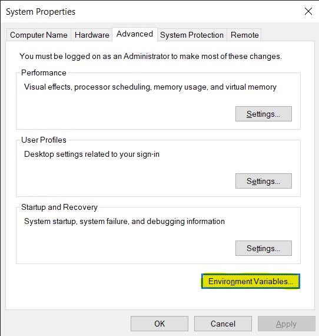

# Windows Instructions

- ## [Installing `git`](#win-installing-git--)
- ## [Installing `cmake`](#win-installing-cmake)
- ## [Installing `MinGW`](#win-installing-mingw)

---


# Installing git  


**Grab the latest git setup from** [here](https://gitforwindows.org). |  The ***default option*** for everything is perfectly fine, just keep clicking next.
:-------------------------:|:-------------------------:
  |  


#### Ensure that `git` was installed successfully:
<br>

Run `git --version` in your command prompt:<br>

> 
<br>

## Configure git:

The steps in this section are very important.

First, let git know who you are, set your global name and email address in your command prompt, this only needs to be done once.
You can paste commands into your Command Prompt by right clicking.

```
git config --global user.name "John Doe"
git config --global user.email johndoe@example.com
```
This is important because every git commit you make will have this information baked into it. This is your identity.

If you like you may also check that your name and email were set correctly with `git config --get user.name` and `git config --get user.email`

#### Personal access tokens:
**Very important:** You will not be able to clone your repositories without first setting up a GitHub Personal Access Token. This is key that grants access to all your repositories, so be very careful with it.

Go to `github.com`, click your profile picture on the top right, click on `settings`. On the sidebar of the next page click `Developer settings` at the very bottom. At the bottom of the sidebar on the next page, click `personal access tokens`

Go to your profile settings   |  Go to `Developer Settings` | Create a `classic` token
:-------------------------:|:-------------------------:|:-------------------------:
  |   |  


|   |
| :----------------------------------------: |
|      **Generate a new token**     |

|    |
| :----------------------------------------: |
|      **check the `repo` box, leave all the boxes below unchecked, scroll down and click `Generate token`**   |


#### Finally, here is your token, this is the first and last time GitHub is going to show it to you, so put it in a secure folder or write it down on paper for future access.


## Cloning a repository


The first time you attempt to clone one of your own repos you will be met with this prompt  |  Go to the `Token` tab and paste in your token
:-------------------------:|:-------------------------:
  |  

**After doing this once you will have permissions to clone repos unprompted.**

<br>

<a name="win_installing_cmake"></a>

# Installing cmake 


### Download `cmake`

Download cmake from [here](https://cmake.org/download/). Choose the `Windows win64-x64 Installer`. You should get an msi with a name similar to this: `cmake-3.19.4-win64-x64.msi`<br>

> 

<br>

You may blindly click through the setup wizard, except for setting the path  |  Important: Make sure to select `Add CMake PATH for all users`
:-------------------------:|:-------------------------:
 |  

### Ensure that cmake was installed successfully:

To make sure `cmake` is intalled correctly, run `cmake --version`:
<br>

> 

If you see something like this, you're good to go!

<br>

---


<a name="win_installing_mingw"></a>

# Installing MinGW 


## Download `MinGW`

Download MinGW from [here](https://github.com/niXman/mingw-builds-binaries/releases). Download the release in below screenshot
> 

Once downloaded use your favorite archive manager(e.g WinRAR, 7-Zip) to extract the archive straight to your C:\ drive
> 


## Set your path environment variable 


Search for "path" in the task bar search box. |  Click `Environment Variables` |
:-------------------------:|:-------------------------:|
   |  

Select `Path` variable and click `Edit`| Click `New` and paste in your `MinGW` path `C:\mingw64\bin`
:-------------------------:|:-------------------------:
  |  

Click `ok` and exit all the system environment windows

Verify the path was set correctly with `g++ --version` and `gdb --version`
> 

If you see that you're all set to start the lab!


---

## Once all software has been installed, continue to the [next step](start_project.md)
