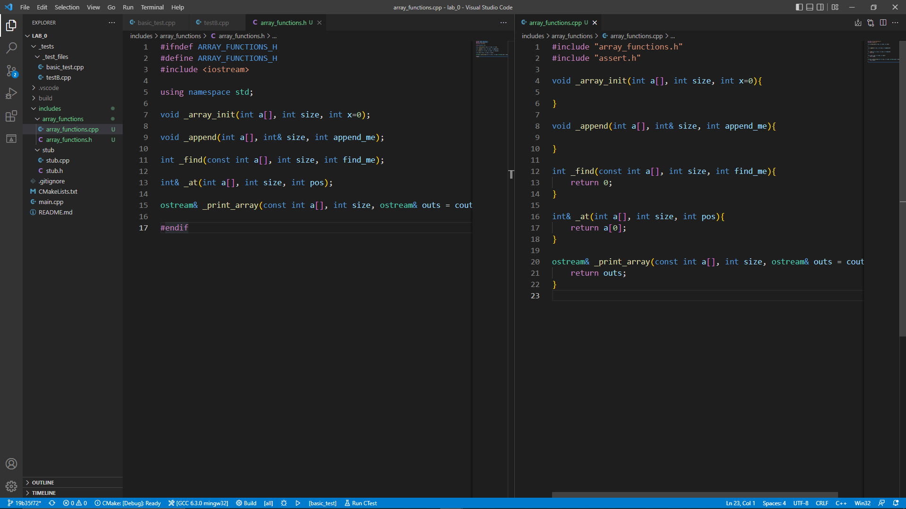
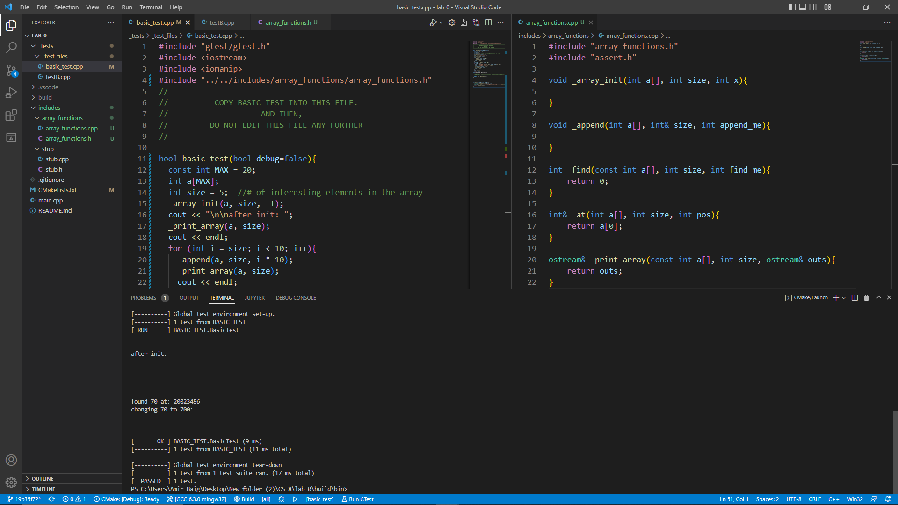
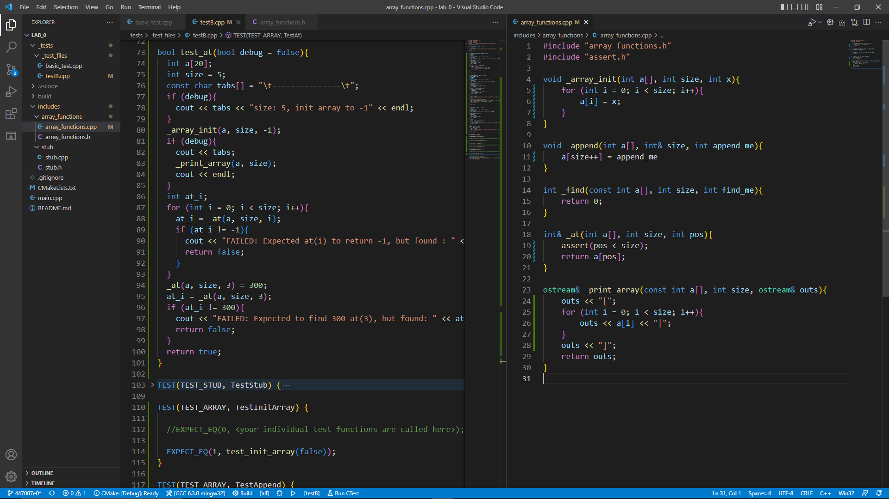
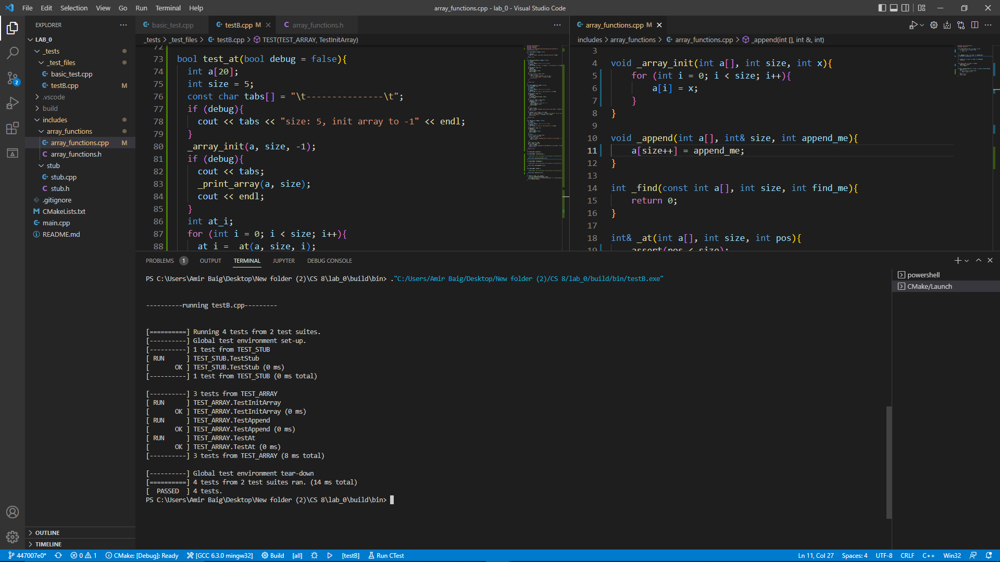

# Windows Insructions</br>

- ## [opening commandline](#win_opening_terminal)</br>
- ## [Installing `git`](#win_installing_git)</br>
- ## [Installing `cmake`](#win_installing_cmake)</br>
- ## [Installing `MinGW`](#win_installing_mingw)</br>
- ## [Accepting the assignment](#win_accepting_the_assignment)</br>
- ## [Project organization](#win_project_organization)</br>

- ## [Quick edit, `status`, `add`, `commit`, & `push`](#win_quick_edit_status_add_commit_n_push)</br>

- ## [Build and run walkthrough](#win_build_and_run_walkthrough)</br>

- ## [Getting started with the project](#win_getting_started_with_the_project)</br>
- ## [Writing tests](#win_writing_tests)</br>
- ## [Completing the project](#win_completing_the_project)

# <BR><BR><BR><BR><BR>

# <BR><BR><BR><BR><BR>

---

# <BR><BR><BR><BR><BR>

<a name="win_opening_terminal"></a>

#  Opening the terminal 

</br>

> 

</br>

---

# <BR><BR><BR><BR><BR>

<a name="win_installing_git"></a>

#  Installing git 

## is `git` installed?

Let's check to see if `git` is installed on your system: type `git --version` at the commandline.

If you do not get a response similar to this, then you do not have `git` on your system and you have to install it.

> 

</br>

## Download `git`

Download git from [here](https://git-scm.com/download/win). You should get an exe similar to this: `Git-2.30.0.2-64-bit.exe`
<br/><br/>

> 

</br>

## Install `git`

Open/run the executable, and follow the steps to install.

</br>

Choose Default.
<br/><br/>

> 

</br>

Choose Git Credential Manager Core.
<br/><br/>

> 

</br>

Select Only show new options if not selected, and click next.
<br/><br/>

> 

</br>

Choose Let git decide.
<br/><br/>

> 

</br>

Choose Use OpenSSH.
<br/><br/>

> 

</br>

Choose Default (fast-forward or merge).
<br/><br/>

> 

</br>

Choose Git Credential Manager Core
<br/><br/>

> 

</br>

And Install!
<br/><br/>

> 

</br>

> 
> 

</br>

When it is done installing, click Finish.
<br/><br/>

> 

</br>

You may view release notes if you want.

> 

<br/><br/>

## Tell git who you are:

Give git your name and email address:

```
git config --global user.name "barkeshli, sassan"
git config --global user.email sxbarkeshli@pasadena.edu

```

<br/><br/>
</br>

## Check the version of the git again:

To make sure `git` is intalled correctly, run `git --version` again:
<br/><br/>

> 

</br>

</br></br></br></br></br></br>

<a name="win_installing_cmake"></a>

#  Installing cmake 

## is `cmake` installed?

Let's check to see if `cmake` is installed on your system: type `cmake --version` at the commandline.

If you do not get a response similar to this, then you do not have `cmake` on your system and you have to install it.
<br/><br/>

> 

</br>

## Download `cmake`

Download cmake from [here](https://cmake.org/download/). Choose the Windows win64-x64 Installer. You should get an msi with a name similar to this: `cmake-3.19.4-win64-x64.msi`
<br/><br/>

> 

</br>

## Install `cmake`

Open/run the executable, and follow the steps to install.
<br/><br/>

> 

</br>

Check I accept the terms in the Liscense Agreement.
<br/><br/>

> 

</br>

**Make sure** to select Add CMake to the system PATH for all users. You can create a Desktop icon if you want, but you will not need to use it for this class.

> 

</br>

The default install location wshould be C:\Program Files\CMake\
<br/><br/>

> 

</br>

Install!
<br/><br/>

> 
> 

</br>

When it is done installing, click Finish.
<br/><br/>

> 

</br>

## Check the version of the git again:

To make sure `cmake` is intalled correctly, run `cmake --version` again:
<br/><br/>

> 

</br>

---

# <BR><BR><BR><BR><BR>

<a name="win_installing_mingw"></a>

#  Install MinGW 

## is `MinGW` installed?

Let's check to see if `g++` is installed on your system: type `g++ --version` at the commandline.

If you do not get a response similar to this, then you do not have `g++` and/or `MinGW` on your system and you have to install it.
<br/><br/>

> 

</br>

## Download `MinGW`

Download cmake from [here](https://sourceforge.net/projects/mingw/files/). You should get an exe named similar to this: `mingw-get-setup (1).exe`

</br>

## Install `MinGW`/`g++`

Open/run the executable, and follow the steps to install.
<br/><br/>

> 
> 

</br>

The default Installation location should be C:/MinGW. Once again, you can add a Desktop shortcut, but it will not be neccesary for this class.
<br/><br/>

> 

</br>

If you get a warning that MinGW is already installed, you can either reinstall and continue with this walkthrough or choose Run Now and skip to the steps below with the MinGW Install Manager.
<br/><br/>

> 

</br>

Installing..
<br/><br/>

> 

</br>

When it is done installing, click Continue.
<br/><br/>

> 

</br>

The **MinGW Installation Manager** should be opened up automatically. For this class, you will need mingw32-base, mingw-gcc-g++, and mingw23-gcc-objc.
<br/><br/>

> 

</br>

To select a package for installation, right click on it in the menu and select Mark for Installation.
<br/><br/>

> 

</br>

Marked packages will be selected like this:
<br/><br/>

> 

<br/><br/>

you **also** need to select the pthreads package from under <br/>
All Packages -> MinGW Libraries
<br/><br/>

> 

</br></br>

Once all neccesary packages have been marked, go to Installations > Apply Changes to install.
<br/><br/>

> 

<br/><br/>
Click Apply

<br/><br/>

> 

</br>

Once the changes are applied you may close the Installation Manager.
<br/><br/>

> 

</br>

## Add g++ as a System Variable and to your path

Search for "path" in the task bar search box. Open Edit the system environment variables.

> 
> <br/>

Click on "Environment Variables..."

> 

<br/>

Add the path to the gcc and g++ executables to environment variables as shown below and press OK.

<br/>

> 

<br/>

Next, double click on the **user variable** Path (in the top half of the window). A window like this should pop up:

> 
>  </br></br>

Click New, and enter C:\MinGW\bin to the text box. Click OK.
</br></br>

> 
> </br>

Your environment and user variables should look like this after you are done:

> 
> </br>

## Check the version of the g++ again:

To make sure `MinGW`/`g++` is intalled correctly, run `g++ --version` again. If the version output doesn't show, reboot your machine and try again.

<br/><br/>

> 

</br>

---

# <BR><BR><BR><BR><BR>

<a name="win_accepting_the_assignment"></a>

#  Accept the assignment 

## Here is the **assignment link** for [CS3A](https://classroom.github.com/a/qidO1KYV) and here is the link for [CS8](https://classroom.github.com/a/DYb_nBnE)

# </br>

## Accept assignment page:

Once you click on the [assignment link](https://classroom.github.com/a/qidO1KYV), we need you to _accept_ the assignment. This will create a repo under your github username.
But before you click and accept the assignment, let's look at a couple of things a bit more closely.
<br/><br/>

> 

</br>

## Your repo name:

This is your repo name. The name of the assignment followed by your github name.
<br/><br/>

> 

</br>

## Accept the assignment

You will _accept_ the assignment by clicking the green button.
<br/><br/>

> 

</br>

## Your assignment repo being created.

Once you accept the assignment, github will begin to creat your assignment repo. You will see this page:
<br/><br/>

> 

</br>

## Your assignment repo:

Give it a few seconds, and reload the page and you should see this:
<br/><br/>

> 

</br>

## look closer:

Take a closer look and youwill see the link to your repo. Click it and you will find your assignment repo:
<br/><br/>

> 

</br>

## Your assignment repo:

Bookmark this page or know how to get here. We'll need to check in here soon.
<br/><br/>

> 

</br>

## The **Code** button:

The green button on the mid-right side that says **Code**, click it and that opens this box:

Click the little clipboard and that will copy the link into your clipboard so you can paste it in the next step. You will use this url to clone your repo:
<br/><br/>

> 

</br>

## clone the assignment repo:

Before you can work on your project, you will need a local copy of the assignment. This is called **cloning** the repository.

**First step** is to `cd` into the fodler where you will be storing all your projects.

`cd` into your projects folder and clone your project there.

and then: `git clone [clone link] [destination_folder]`

That's what's happening here. I don't like my folder name to be `lab_00_barkeshli`. I like `lab_00`, so, I give it the new name and that clones the project into a folder named `lab_00`

> 

</br>

## `cd` into this project folder:

> 

</br>

We will be using VS Code to view and edit our code. Open your newly cloned project int VS Code.

</br>

---

# <BR><BR><BR><BR><BR>

<a name="win_project_organization"></a>

#  Project Organization: 

Once you have cloned the project and you open VSCode, this is what you will see:
<br/><br/>

> 

</br>

## File system:

All the projects in this class will follow the same file organization.

On the left panel (Explorer, ) you will find the `main.cpp` on the root folder, and the three most important folders in this directory:

`_tests`: which holds your google test files. The grader will run these files to obtain your score. You will ignore `testA.cpp` for the most part. The bulk of your work will be done in `testB.cpp`.

`includes`: contains a folder for each of the libraries / classes your project depends on. In this starter code, you only have a `stub` folder that contains `stub.h` and `stub.cpp`. These files are `#include`d in `testB.cpp`

`build`: is where you go to build and run your project. This is where all your compiled and executable files will end up.
<br/><br/>

> 

</br>

## A look at the test files:

### basic_test.cpp: My sample test goes here.

This is the placeholder file for a sample test file you wilkl be given for each and every project. The purpose of this file is to demonstrate the functionality of the project and for you to make sure that your function signatures and class declarations match the grader's expectations. (otherwise, your projects will not earn a score.)

### testB.cpp: Your tests go here

This is the file that will contain your tests of your own functions and classes. All your test fils that will demonstrate the correctness of your poject are housed here. Part of your grade relies on the quality and success of the tests in this file.
<br/><br/>

> 

</br>

## CMakeLists.txt

The github grader as well as your local Mac or linux systems will use the CMakeLists.txt file to build your project.

### List your cpp files here

the `CMakeLists.txt` file is what the cmake program looks at to know how to build your project. How the pieces fit together.

When you submit your code, you need to tell it what files are needed to build the test executables.

The grader will also use this file to build your project on the server side (once you submit - push your projects to github)

Please note that you will **only** make changes to the bottom half of this file.
It's worth mentioning that every **.cpp** file that is used in any of your test files (main, basic_test, testA, testB) will have to be listed here. Notice how the stub.cpp is listed under ADD_EXECUTABLE(testB...)
<br/><br/>

> 

</br>

## stub.h, stub.cpp

Not too much to see here. The stub is used in testB to demonstrate how a function will be tested by the googletest framework in `testB.cpp`. All your functions and classes will be housed under their own folder (`stub/`, `array_functions/`, `vector/`, etc.) which will, in turn, go under the `includes/` folder.
<br/><br/>

> 

</br>

---

## Open terminal:

If you are using VSCode, you can open the terminal by pressing [ctrl][`]

[`] is the key in the top left of the keyboard under [~]

Using the terminal in this way is very convenient.

<br/><br/>

> 

</br>

# <BR><BR><BR><BR><BR>

<a name="win_quick_edit_status_add_commit_n_push"></a>

#  Quick edit, `status`, `add`, `commit` & `push` 

</br>

One of the main tasks in this class is tracking changes made to the project. We need to know what happened when and what changed. This is both for your peace of mind (helps you not lose your project accidentally,) and for me to track your progress throught he course.

We use **git** to track changes.

**Here**, we will make some small change to one of our files and walk through the entire process of tracking that change with `git`, just so you can get used to it.

</br>

## `git status`

let's run `git status`. look at the response: It says there are not changes as of yet. That's correct, isn't it. We have not made any changes.
<br/><br/>

> 

</br>

## Edit the README.md

Enter your name in the README.md and save it.
<br/><br/>

> 

</br>

## `git status` again:

if you run `git status` again, you will see that git has kept track of our changes. this time, it says that the file `README.md` has changed. But it says that the file is not _staged_ for commit.

Think of it this way... There are four zones:
</br></br>

[changes not staged]

---- `git add`--->

[staged changes, but not committed]

---- `git commit`--->

[committed changes]

---- `git push`--->

[pushed, or synched with remote site]

You go from zone to zone by the commands listed above.

<br/><br/>

> 

</br>

## `git add` and then, `git status` again:

In order to _stage_ the changes for `commit`, Enter `git add README.md`. This will stage the file.

do `get status` again. Now, you see that `README.md` has been _staged_

<br/><br/>

> 

</br>

## `commit` your changes:

You `commit` your changes to permanently record these changes to `git`. If somehow you ruin your project (as we all have done from time to time,) you can _revert_ to this state of your project.

`commit`ting is like _saving_ your changes to `git`

Enter `git commit -m "[explain what you just did, in your own words]"`

Here,`-m` is a switch that tells `git` that you will be typing a message to document what this `commit` was for. We want this message to be concise and descriptive of the work that is being recorded.

Try typing in your own message in your own words.

<br/><br/>

> 
> </br>

## Has Github assignment repo changed?

Take a look at your assignment repo on your browser. You will see that eventhough you have committed your changes, Github does not know about them!

`commit`ting only records your changes on your local machine.
</br>
</br>

## What is my local `branch` name?

If we want Github to know about our changes, we must `push` them to Github. But before you do, let's find out what our current _branch_ is.

For me, the branch name is `master` as evidenced by these images.

Your bash prompt on your terminal:

<br/><br/>

> 

<br/>

## Zoomed in:

`git branch` will tell you the name of our local branch. Try it.

<br/><br/>

> 

</br>

## `git push`:

Since my branch name is `master`, I will issue the command `git push origin master` which means push to `origin`, which is my github remote name, from `master` which is my local branch name. For you, your branch namge might be `main`, so, your commmand will be `git push origin main`:

If your command is successful, you will get a response similar to this:

<br/><br/>

> 

</br>

## Now, Github knows about our changes:

Take a look at your project repo on Github. See how the changes you made to README.md shows on your repo:
<br/><br/>

> 

</br>
</br>

## `commit` and `push` often:

Make sure you `commit` your changes after completion of **every** task. Remeber, `commit`s are the record of your progress. You will be graded on your commits. And push your changes frequently.
<BR><BR>
<BR><BR>
<BR><BR>
<BR><BR>

## Bonus: `git log`

Enter `git log` and see what the response is. What does this command do?

---

# <BR><BR><BR><BR><BR>

<a name="win_build_and_run_walkthrough"></a>

#  build and run walkthrough 

</br>

Once your project is open in VS Code, we will do a quick excersise to show you how to run it.
<br/><br/>

> 

</br>

</br></br></br>

## The batch files:

The two batch files gtest.bat and build.bat should look like this:
gtest.bat:

```
git clone https://github.com/google/googletest.git
cd googletest && mkdir build && cd build && cmake -G "MinGW Makefiles" .. && make && cd ../../
```

if this gives you trouble, try replacing make with MinGW32-make like this:

```
git clone https://github.com/google/googletest.git
cd googletest && mkdir build && cd build && cmake -G "MinGW Makefiles" .. && MinGW32-make && cd ../../
```

build.bat:

```
g++ -std=gnu++11 -o basic_test ../_tests/_test_files/basic_test.cpp -Igoogletest/googletest/include -pthread -Lgoogletest/build/lib -lgtest
g++ -std=gnu++11 -o testA ../_tests/_test_files/testA.cpp ../includes/stub/stub.cpp -Igoogletest/googletest/include -pthread -Lgoogletest/build/lib -lgtest
g++ -std=gnu++11 -o testB ../_tests/_test_files/testB.cpp ../includes/stub/stub.cpp -Igoogletest/googletest/include -pthread -Lgoogletest/build/lib -lgtest

```

<a name="win_build_googletesr_framework"></a>

## Build the googletest framework

Before you can run your tests on your program, you must build the googletest framework. This has to be done only once per project **before** you do anything else.

To simplify this process, and the building of your project, a pair of batch files have been written.

The two .bat files you will use to build and compile your project: gtest.bat and build.bat will be included with your startup code for every project.

Navigate into the build folder and run gtest.bat by entering .`\gtest.bat` into the terminal. This will run a series of commands that build the googletest framework for you. This process creates a bunch of files and you do not want these files in the root folder of your project. Running the `gtest.bat` file from `build/` will make sure all your auxilary files are created inside the `build/` folder. The output should look like this.
<br/><br/>

> 

</br>

build.bat needs to be run every time you make changes to your code. It creates executable files that you can run in the terminal. Run build.bat by entering `.\build.bat` into the VS Code terminal. It will create 3 executable files: testA.exe, testB.exe, and basic_test.exe.

Once your executables have been sucessfully created, you can run the basic_test.exe by entering `.\basic_test.exe` into the VS Code terminal.
<br/><br/>

> 

</br>

# <BR><BR><BR><BR><BR>

<a name="win_getting_started_with_the_project"></a>

#  Getting started with the project 

</br>

## Find <a href="./basic_test.cpp" target="_blank">`basic_test.cpp`</a>

</br>

You will be supplied with a <a href="./basic_test.cpp" target="_blank">`basic_test.cpp`</a> file. You will copy this file and overwrite the existing _generic_ `basic_test.cpp` in your project folder. After this, you will **never** edit the `basic_test.cpp` file.

<a href="./basic_test.cpp" target="_blank">`basic_test.cpp`</a> demonstrtes the functionality of the project and gives you an opportunity to make sure your function signatures and class declarations match those of the grader.
You should be able to compile and run the `basic_test.cpp` with your functions.

Pay special attention to the `#include` path at the top. Your file structure has to be **exactly** the same as the one depicted here.

###### click <a href="./basic_test.cpp" target="_blank">here</a> to download basic_test.cpp if you have not already.

<br/><br/>

> 
> </br>

## Add a new folder to the `includes/` folder.

name this folder `array_functions`.

This is where you will add your `.h` and `.cpp` files

<br/><br/>

> 
> </br>

## Add two files to this folder.

Name these two files `array_functions.h` and `array_functions.cpp`

<br/><br/>

> 

</br>

## Add the function signatures.

add these function signatures to the `array_functions.h` file:

```
void _array_init(int a[], int size, int x=0);
void _append(int a[], int& size, int append_me);
int _find(const int a[], int size, int find_me);
int& _at(int a[], int size, int pos);
ostream& _print_array(const int a[], int size, ostream& outs = cout);

```

Normally, you will either be given these function signatures or you will _deduce_ them from the code in `basic_test.cpp`

<br/><br/>

> 

</br>

## Write function _stubs_

Function stubs are just function signatures with a return statement if needed.

Function stubs are a quick way to get the project up and running. I find the students who adopt this method in their workflow have an easier time completing projects.

### TIP:

I normally copy the function signatures and paste them into the `.cpp` file. Then, I replace the `;` at the end of the line with braces (`{}`). Then, I add the returns whenever necessary.

<br/><br/>

> 
> </br>

## Build googletest framework

</br>

</br>

## Go to `build/` and run `gtest.bat`:

`cd` into the `build/` folder, and from there, run `.\gtest.bat` Remember, you only do this per project. So, if you have already done this in the previous steps, you should skip it.

Now, we are ready to compile our project using `.\build.bat`

If you followed these steps faithfully, you will have the same syntax errors that I had, namely that all those functions we defined in `array_functions.h` and `.cpp` are **undefined!**

<br/><br/>

> 

</br>

## `build.bat` errors, zoomed in:

Here is a closer, more readable look at the errors reported by `.\build.bat`

<br/><br/>

> 

</br>

## the batch file

We will spare you the suspense. The reason for this error is that we never added `array_functions.cpp` to our `build.bat`.

A brief explanation of the line of code in buld.bat follows:
<br/>
`g++ -std-gnb++11 -o basic_test ../_tests/_test_files/basic_test.cpp ../includes/stub/stub.cpp -Igoogletest/googletest/include`

`basic_test` in this command is the name of the executable that will be created.

Starting from `-Igoogletest/googletest/include`, there is nothing you need to change in the line. This is a googletest option.

**All .cpp** files must be listed in the build.bat between the executable name and the googletest options at the end of each command.

<br/><br/>

> 

</br>

## Editing the batch file

<br/><br/>

> 

</br>

## back at the `CMakeLists.txt`:

Even you, who uses windows and may not have any use for the `CMakeLists.txt` _locally_, **MUST** make sure `CMakeLists.txt` reflects the current state of your project. Otherwise, the grader will not be able to compile and run your project.

Notice that we are missing the `array_functions.cpp` from the `basic_test` `ADD_EXECUTABLE` statement:

So, let's add it...
<br/><br/>

> 
> </br>

</br>
</br>

## Add `array_functions.cpp` to the `ADD_EXECUTABLE(basic_test... )`

**Do not** use commas to separate the files.

**Do NOT** include `.h` files.

Normally, **all** three executables will need all the `.cpp` files

<br/><br/>

> 

</br>

> 
> </br/>

## `.\build.bat` again:

Let's run `.\build` again and pray that...

... and, we have more syntax errors. Default arguments can only be specified in the declration of the function and **not** in the definition.

So, we must remove all those default values for the defalut arguments on every function.

<br/><br/>

> 
> </br>

## Fix the `_print_array` function...

<br/><br/>

> 
> </br>

## by removing the default value `= cout`

## Same with `_array_init`:

<br/><br/>

> 
> </br>

## `.\build.bat` one more time:

and this time it will run successfully.

This is a huge step. We now have a working project eventhough our functions are basically empty.

You can even run `basic_test.exe`. Of course this will not run satisfactorily. You will get mostly garbage. -afterall, we are running on stubs!- but it **does** run!!

<br/><br/>

> 
> </br>

</br>

## run `git status`, `add`, and `commit` with the message _success on make with stubs_

### The importance of having **regular** `commit`s in your project cannot be overstated. This is a large part of the evaluation of your project by me.

</br></br>

> 

</br>

> 

</br><br/>

## Implement `_array_init` and `_print_array`. `testB.cpp` can be seen waiting to host the test functions.

Now, we can go in and implement the functions one by one and write tests for them. These tests will be written in the `testB.cpp` file.

</br>

---

# <BR><BR><BR><BR><BR>

<a name="win_writing_tests"></a>

#  Writing Tests: 

<br/>
</br>

## `testB`: Our first test:

After implementing the \_array_init and \_print_array functions, we will write a simple test that will verify that the \_init function works as it should.

The test function is boolean. It returns `true` if the init function works properly and false otgherwise.

Call the `_array_init` function and then go through each and every cell and verify that each element is -1.

If you find one cell that is not -1, return false.

Note also that we return `true` at the end of the test function. I do this in every test function I write.

<br/>

</br>

## The `TEST` function:

The `TEST` function is part of the googletest testing framework. To simplify our work, we always use the same format for the `TEST` function: Declare a `bool success` and assign it to the return value of the test function.

Then, compare `success` with `1` or `true`

A quick word about the two arguments of the `TEST` function:

The first is the name of the _test suit_ and the second is the name of this very test. Each test suit may contain multiple tests. Later, we will write another test for the `_append` function with the same first argument as this test: `TEST_ARRAY`. By the time we are done, the `TEST_ARRAY` test suite will have three individual tests.

Pay attention to the **naming conventions** for this course: The test suite will be in ALL CAPS with underscores between the words. The test names will be camel case and regular function names are all lower case with underscores.
<br/><br/>

> 
> </br>

## build and RUN!!

This time, we will run `.\build.bat` successfully and then, we run the `testB` executable by typing `.\testB.exe`

This will display two successful test runs: one for the `stub` test that was already part of the project, and one for the `TestInit` that we just wrote.

This means that our test function returned `true`.

<br/><br/>

> 

</br>

> 
> </br>

## Implement `_append` and `_at`:

We have thus far implemented `_array_init` and `print_array`. Let's implement `_append` and `_at` as well.

You will _borrow_ my code for this particular lab, but make sure you comment the code very well.

Once we have implemented `_append`, write the test for it in `testB.cpp`. Don't forget to add a `TEST( )` for the `test_append()` function.

<br/><br/>

> 

<br/><br/>

Obviously, this is done in the `testB.cpp` file. Again, do not forget to add the `TEST( )` function for `test_at()`

Once again, you will _borrow_ my code for this particular lab, but make sure you comment the code very well.

<br/><br/>

> 

<br/><br/>

## `.\build.bat` and run `testB.cpp` again:

Let's `.\build.bat` and run `testB` to make sure our `test_append` and `test_at` pass:

<br/><br/>

> 

---

# <BR><BR><BR><BR><BR>

<a name="win_completing_the_project"></a>

#  Completing the project 

## Implement the `_find()` function on your own

You will also write a `test_find()` function. Once you have implemented `_find()` and written the test function for it (don't forget to comment) you are ready to `.\build.bat` and run `testB` once again.

Once you have successfully run `testB` with `_find`, you `git add ` and ` commit` your changes. Once again, do not forget to update your CMakeLists.txt file for the autograder.

<br/><br/>

> 

<br/><br/>

## Finally, we can run `basic_test.cpp`:

Now that we have implemented all the functions that are used in `basic_test.cpp`, we can `make` and run this file.

I cannot overemphasize how important it is for this test to be able to compile and run **without** your editing it in any way. If your project cannot compile and run `basic_test`, the grader will not be able to run your project.

<br/><br/>

> 

<br/><br/>

## `git add` and the final `git commit`

Let's go back to the root directory by typing `cd ..` - remember that `..` means parent directory. `cd ..` means change directory to the parent.

My commit message will let me know what stage of the development I am in. I have just PASSED both the `basic_test` and `testB`

<br/><br/>

> 

</br>

## Autograder Status

You can keep track of the grading status of your project on the assigmment page. A yellow dot means that the tests are still being compiled and run by the autograder.This shouldn't take more than a minute or two. You can refresh the page to update the status. A green checkmark neans that all your tests have passed. A red x means that at least one test failed.

<br/><br/>

> 

</br>

> 

</br>

To see a more in depth output of the autograder test runs, click on the Details link:

<br/><br/>

> 

</br>

It will take you to this page:
<br/><br/>

> 

</br>

> 

</br>

> 

</br>

> 

</br>

> 

</br>

> 

</br>

> 
